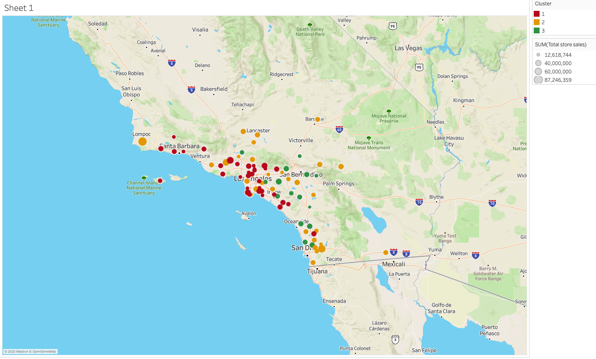

# Predictive Analytics for Business Nanodegree, Udacity
This repository contains my analytics projects as part of the Predictive Analytics for Business Nanodegree granted by Udacity

## Project Deliverables
**1. [Project 1: Predicting Catalog Demand using a Linear Regression Model](https://github.com/grace-radetsky/Predictive-analytics-via-Udacity/tree/main/Project%201-%20Predicting%20Catalog%20Demand%20(using%20Linear%20Regression)/workflows)**
- In this project, I analyzed a business problem in the mail-order catalog business. I predicted how much profits the company can expect to gain from sending out a catalog to new customers.
- Method: 
  - Build a linear regression model with variables contributed to past revenues. 
  - Apply the model to the new customer data to predict revenues. 
  - Calculate expected profits based on the given data on average gross margin on product sold and cost of printing and distributing the catalogs.
- Tools: Alteryx
- Artifacts: [Process and finding writeup](https://github.com/grace-radetsky/Predictive-analytics-via-Udacity/blob/main/Project%201-%20Predicting%20Catalog%20Demand%20(using%20Linear%20Regression)/workflows/Project-1_Predicting-catalog-Demand.pdf), [Linear Regression Workflow](https://github.com/grace-radetsky/Predictive-analytics-via-Udacity/blob/main/Project%201-%20Predicting%20Catalog%20Demand%20(using%20Linear%20Regression)/workflows/linear%20regression%20workflow.yxmd)

**2. [Project 2: Create An Analytical Data Set](https://github.com/grace-radetsky/Predictive-analytics-via-Udacity/tree/main/Project%202%20-%20Data%20Wrangling)**
- In this project, I cleaned up a sales data set in preparation for a linear regression prediction. I addressed data issues, such as duplication, missing values, outliers, improperly parsed data fields, extra characters
- Tools: Alteryx Designer for data wrangling, Excel for IQR calculations and analyzing the impacts of different outlier treatments
- Artifacts: [Process and finding writeup](https://github.com/grace-radetsky/Predictive-analytics-via-Udacity/blob/main/Project%202%20-%20Data%20Wrangling/Project%202-Data%20Wrangling.pdf), [Alreryx workflow](https://github.com/grace-radetsky/Predictive-analytics-via-Udacity/tree/main/Project%202%20-%20Data%20Wrangling/workflows)

**3. [Project 3: Predicting Default Risks using Classification Model](https://github.com/grace-radetsky/Predictive-analytics-via-Udacity/tree/main/Project%203%20-%20Predicting%20Default%20Risks%20(Classification%20Models))**
- In this project, I used a classification model to algorithmically classify new customers on their creditworthiness. The outcome is a list of creditworthy customers submitted to the manager
- Method:
  - Clean the data set by eliminating variables that have high percentages of missing values, low variability, or have no logical connection with the target variable
  - Build 4 models: Logistics Regression, Decision Tree, Forest Model, and Boosted Tree. Compare models based on accuracy rate against a validation data set and on their prediction biases then choose the best model to use in production
  - Apply the choosen model to the new customer data set to get the classification probabilities
- Tools: Alteryx Designer
- Artifacts: [Process and finding writeup](https://github.com/grace-radetsky/Predictive-analytics-via-Udacity/blob/main/Project%203%20-%20Predicting%20Default%20Risks%20(Classification%20Models)/Project3_Predict%20Default%20Risk.pdf), [Alteryx workflow](https://github.com/grace-radetsky/Predictive-analytics-via-Udacity/tree/main/Project%203%20-%20Predicting%20Default%20Risks%20(Classification%20Models)/workflows), [cleaned data sets](https://github.com/grace-radetsky/Predictive-analytics-via-Udacity/tree/main/Project%203%20-%20Predicting%20Default%20Risks%20(Classification%20Models)/cleaned%20data%20sets)

**4. [Project 4: A/B Testing on A New Menu Launch](https://github.com/grace-radetsky/Predictive-analytics-via-Udacity/tree/main/Project%204%20-%20A:B%20Test%20a%20New%20Menu%20Launch)**
- In this project, I analyzed a match-paired A/B test and write up a recommendation to management about whether a new menu should be launched in certain markets.
- Method:
  - Use trend, seasonality, and average monthly sales from historical data as variables to match treatment stores with control stores. 
  - Analyze the average lift, expected impact (expressed by the increase in the gross margin per store per week), and the significant level of the prediction between two groups in the experiment to make a business recommendation.
- Tools: Alteryx
- Artifacts: [Process writeup](https://github.com/grace-radetsky/Predictive-analytics-via-Udacity/blob/main/Project%204%20-%20A:B%20Test%20a%20New%20Menu%20Launch/Project4_AB%20testing.pdf), [Alteryx Workflow](https://github.com/grace-radetsky/Predictive-analytics-via-Udacity/tree/main/Project%204%20-%20A:B%20Test%20a%20New%20Menu%20Launch/workflows), [cleaned data sets](https://github.com/grace-radetsky/Predictive-analytics-via-Udacity/tree/main/Project%204%20-%20A:B%20Test%20a%20New%20Menu%20Launch/cleaned%20data%20sets)

**5. [Capstone Project: Combining Clustering, Classification Models, and Time Series Analysis](https://github.com/grace-radetsky/Predictive-analytics-via-Udacity/tree/main/Capstone%20Project-Combine%20Predictive%20Techniques)**
- In this project, I grouped existing stores into different groups using a cluster model to manage inventory more effectively. Then I used a Boosted Model to group new stores into those formats. And use an ATS - time series analysis model to predict monthly sales in 2016 for both existing and new stores.

- Tools: Alteryx, Tableau
- Artifacts: [Process writeup](https://github.com/grace-radetsky/Predictive-analytics-via-Udacity/blob/main/Capstone%20Project-Combine%20Predictive%20Techniques/Capstone%20Project%20Submission.pdf), [Alteryx Workflow](https://github.com/grace-radetsky/Predictive-analytics-via-Udacity/tree/main/Capstone%20Project-Combine%20Predictive%20Techniques/workflows), [cleaned data sets](https://github.com/grace-radetsky/Predictive-analytics-via-Udacity/tree/main/Capstone%20Project-Combine%20Predictive%20Techniques/cleaned%20data%20sets)
